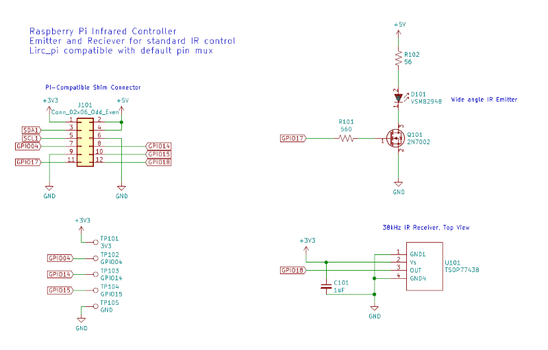

# PiRCy #

The Raspberry **Pi** **R**emote **C**ontrol Thing**y**


This is an extension board to add infrared remote control inputs and outputs to your Raspberry Pi.  

It is designed to replace your IR receiver, breadboard, and jumper wires with an elegantly positioned module.  This should increase the living-room acceptance factor of your Kodi-enabled Pi by at least 75%.

Along with the Vishay TSOP77438 IR Receiver, this extension has a VSBM2948 IR emitter to control other AV equipment, such as DVD players.  It has a half-angle (beam width) of 25 degrees, so alignment isn't too critical.



For the enterprising hacker, there are via pads for 3.3V, Ground, and GPIOs 4, 14, and 15.  

## Hardware Installation

Affix PiRCy to the 40-pin GPIO header as shown:


The IR components should face outward from the Pi, and ideally toward your couch.  PiRCy sits at the very end of the 40-pin GPIO header.

## Basic Software Configuration

The pin assignment of the IR receiver and IR emitter are on the defaults for the "lirc" kernel module on RPi models 0, A, and B.  You 
can test PiRCy by loading the kernel module and using the "mode2" command while pushing buttons on your remote.  At the terminal:

```
# sudo modprobe lirc_rpi
# mode2 -d /dev/lirc0
space 1192
pulse 601
space 1098
pulse 599
...
```

Press ```<CTRL-c> ``` to exit the mode2 program.  The ```irrecord``` utility is awesome for creating a new ```lircd.conf``` file if you have a remote that is not yet included in the database.  Launch it, then follow the instructions to record and assign your buttons.


## Media Center Distribution Configuration

Under OSMC, there is an option to enable lircd; it helpfully sets up the boot parameters in the background so a simple reboot 
after enabling is all it takes.  If you have a recognized remote, you are effectively finished now.  However, OSMC's configuration 
dialog lets you point at a custom configuration file as well, so you can use the ```lircd.conf``` that was created above by 
```irrecord```.

Due to some resource conflicts (interrupt latency primarily), the lirc kernel module is considered somewhat deprecated for media 
center use.  Kodi and LibreElec recognize the built-in ```gpio-ir``` module natively.

Within the config.txt file in /boot, add the following parameter (no ```gpio_pin``` options needed):

```dtparam=gpio-ir```

Reboot your Raspberry Pi to effect the change to the boot options.

To test, run the keytable test utility from a terminal:

``` # ir-keytable -t ```

Push some buttons on your remote to see if the keytable test returns mark/space data.  


